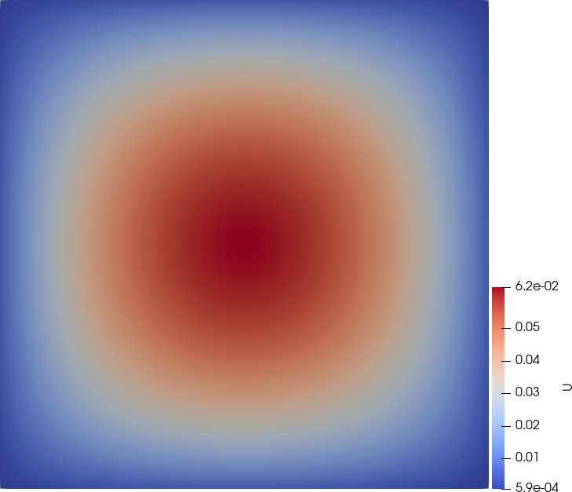

# Résolution d'une équation de diffusion par décompostion de Schwarz additive

# Les équations

Ce code permet de résoudre une équation de diffusion par décomposition de domaine de type Schwarz additive. L'équation résolue est du type

Équation de diffusion :

$$
\partial_t u(x,y,t) - D \Delta u(x,y,t) = f(x,y,t),
$$

Conditions aux limites :

$$
u \mid_{\Gamma_0}= g(x,y,t), \quad u \mid_{\Gamma_1} = h(x,y,t).
$$

sur $$\Omega = [x_\text{min}, x_\text{min}] \times [y_\text{min}, y_\text{min}]$$, avec $$\partial\Omega = \Gamma_0 \cup \Gamma_0$$.

## Prérequis
- [MPI](https://www.open-mpi.org/) installé sur votre système
- [Paraview](https://www.paraview.org/) pour la visualisation des résultats
- Compilateur C/C++ compatible (gcc, clang, etc.)
- Make pour la compilation




## Lancer une simulation

1. **Préparation du fichier de configuration**  
   - Créez un fichier `data.toml` dans le dossier `data/` avec les paramètres suivants :  
     ```toml
     cas = 1   # Choisir 1, 2 ou 3
     xmin = 0.0
     xmax = 1.0
     ymin = 0.0
     ymax = 1.0 # Dimensions du domaine
     D = 1.0   # Coefficient de diffusion
     Tf = 10.0 # Temps de simulation
     dt = 0.1  # Pas de temps
     Nx = 100  # Nombre de points en x
     Ny = 100  # Nombre de points en y
     Solver = "CG" # Choix du solveur "CG", "BiCGstab" ou "Jacobi" (CG ou jacobi si les matrices sont sdp)
     r = 2     # Recouvrement (minimum 2)
     alpha = 0.0
     beta = 1.0 # Coefficients des condition aux limites type Fourier-Robin
     ```

2. **Compilation**  
   - Ouvrez un terminal dans le dossier `src/` et exécutez :  
     ```sh
     make clean && make
     ```

3. **Exécution**  
   - Lancez la simulation avec MPI (ici avec 4 processus) :  
     ```sh
     mpirun -n 4 ./run ../data/data.toml
     ```

4. **Récupération des résultats**  
   - Les fichiers de sortie (`*.vtk`) seront générés dans le dossier `res/`.  
   - Utilisez Paraview pour les visualiser :  
     ```sh
     paraview res/*.vtk
     ```

## Structure des dossiers

- `data/` Contient le fichier de paramètres data.toml
- `res/` Contient les fichiers résultats VTK
- `src/` Contient le code source


## Notes
- Ajustez le nombre de processus (`-n 4`) en fonction de votre système.
- Assurez-vous que le recouvrement `r` ≥ 2 dans `data.toml`.
- Utilisez le bon solveur en fonction des conditions aux limites utilisées.

